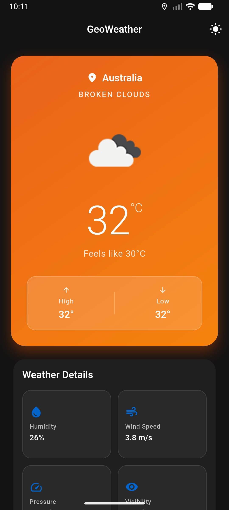
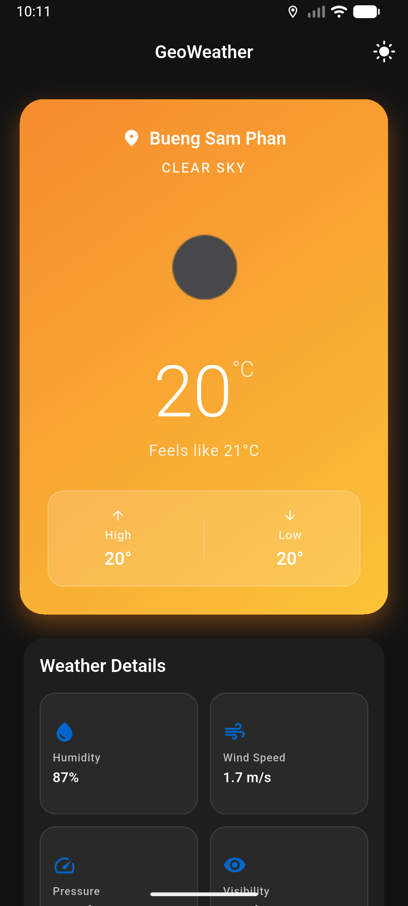
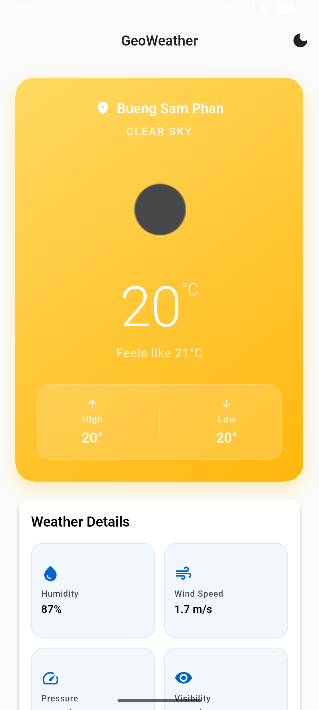
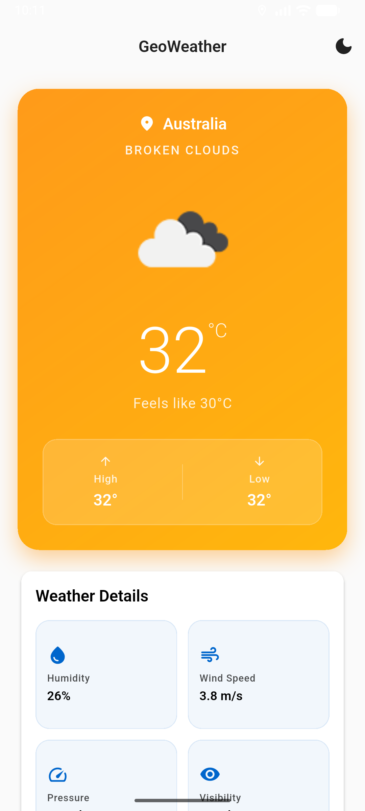
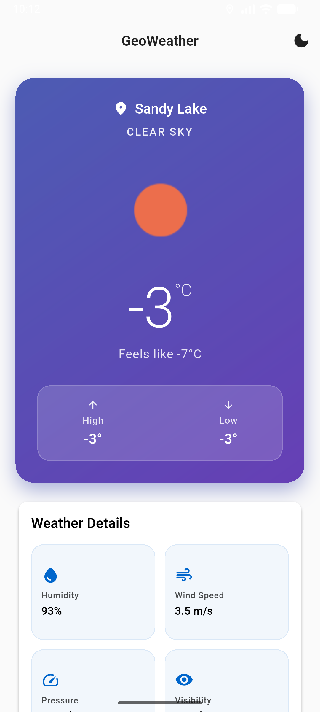
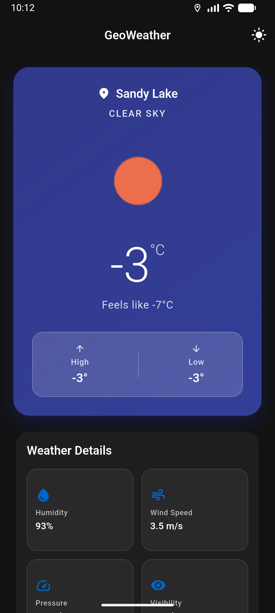
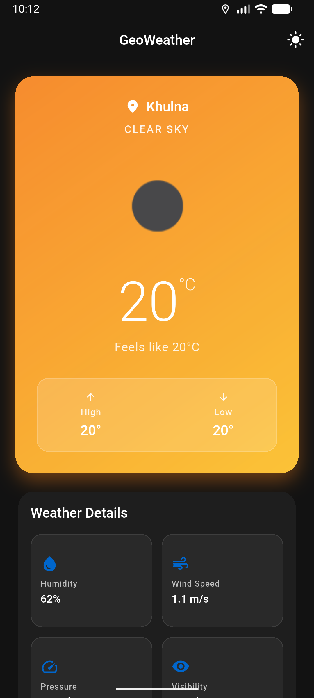

# GeoWeather

A clean, modular Flutter weather application built as a coding challenge solution. This app demonstrates professional software engineering practices with Clean Architecture principles, GetX state management, and displays real-time weather conditions using the OpenWeatherMap API.

## 📋 Challenge Requirements - Implementation Status

This project fulfills all the core requirements of the **Software Engineer (Flutter) Coding Challenge**:

### ✅ Core Features Implemented

1. **Single-Screen Weather Application**
   - ✅ Home Screen with automatic location detection
   - ✅ Displays current weather for user's geographical location

2. **Required Data Points**
   - ✅ City Name / Location Name
   - ✅ Current Temperature (Celsius/Fahrenheit)
   - ✅ Weather Condition (Clear, Rain, Clouds, etc.)
   - ✅ Weather Icon
   - ✅ Minimum and Maximum Daily Temperatures

3. **Technical Requirements**
   - ✅ Clean Architecture implementation with proper layer separation
   - ✅ GetX for state management and dependency injection
   - ✅ OpenWeatherMap API integration
   - ✅ Automatic location detection using Geolocator

4. **Additional Features Implemented**
   - ✅ Offline support with local caching (Shared Preferences)
   - ✅ Network connectivity checking
   - ✅ Pull-to-refresh functionality
   - ✅ Error handling and loading states
   - ✅ Material Design UI with theme support
   - ✅ Secure API key management with Envied package

### 📸 Screenshots

<div align="center">
  
  
  
  
</div>

<div align="center">
  
  
  
  
</div>

---

## Features

- 🌍 **Auto-Location Detection** - Automatically detects your location
- 🌤️ **Real-time Weather** - Fetches current weather from OpenWeatherMap API
- 💾 **Local Caching** - Caches weather data for offline access
- 🎨 **Material Design** - Modern, clean UI with light and dark themes
- 🔒 **Secure API Keys** - Uses `envied` package for secure environment variable management
- 📦 **Modular Architecture** - Clean architecture with separation of concerns
- ⚡ **GetX State Management** - Efficient state management and dependency injection

## Project Structure

```
lib/
├── main.dart                    # App entry point with GetX initialization
├── app/
│   ├── routes/
│   │   ├── app_pages.dart       # Navigation pages/routes
│   │   └── app_routes.dart      # Route constants
│   └── bindings/
│       └── initial_bindings.dart # App-wide dependency bindings
├── core/                        # Shared core functionality
│   ├── constants/               # App and API constants
│   ├── errors/                  # Custom failures and exceptions
│   ├── network/                 # Dio HTTP client configuration
│   ├── services/                # Storage and location services
│   ├── theme/                   # App theme, colors, text styles
│   ├── utils/                   # Extensions and helper utilities
│   └── widgets/                 # Reusable UI components
├── features/                    # Feature-based modules (Clean Architecture)
│   ├── weather/                 # Weather feature module
│   │   ├── data/                # Data layer
│   │   │   ├── datasources/     # Remote (API) & Local (Cache) sources
│   │   │   ├── models/          # Data models with JSON serialization
│   │   │   └── repositories/    # Repository implementations
│   │   ├── domain/              # Domain layer (Business logic)
│   │   │   ├── entities/        # Core business entities
│   │   │   ├── repositories/    # Repository contracts (abstract)
│   │   │   └── usecases/        # Business use cases
│   │   └── presentation/        # Presentation layer
│   │       ├── controllers/     # GetX controllers for state management
│   │       ├── pages/           # UI screens
│   │       ├── widgets/         # Feature-specific widgets
│   │       └── bindings/        # GetX dependency bindings
│   └── settings/                # Settings feature (bonus)
│       ├── data/
│       ├── domain/
│       └── presentation/
├── injection/
│   └── injection_container.dart # Global dependency injection setup
└── env/
    ├── env.dart                 # Environment variables (envied)
    ├── env.g.dart              # Generated environment file
    └── ENV_SETUP.md            # Environment setup guide
```

## Architecture

This project follows **Clean Architecture** principles with layered separation as per the challenge requirements:

### 📐 Architecture Layers

- **Presentation Layer**: UI components, pages, and GetX controllers
  - Handles user interactions and UI state
  - Uses GetX for reactive state management
  
- **Domain Layer**: Business logic, entities, and use cases
  - Core business rules independent of frameworks
  - Defines contracts through abstract repositories
  
- **Data Layer**: Repositories, datasources (remote/local), and models
  - API integration with OpenWeatherMap
  - Local caching with Shared Preferences
  - Network connectivity management

### 🎯 Design Patterns Used

- **Repository Pattern**: Abstracts data sources
- **Use Case Pattern**: Single responsibility business logic
- **Dependency Injection**: GetX dependency management
- **Either Pattern**: Functional error handling with Dartz
- **Factory Pattern**: Model creation and parsing

## Technologies & Packages

### Core Technologies
- **Flutter 3.10+**: UI framework
- **Dart 3.10+**: Programming language
- **GetX**: State management and dependency injection (as per requirements)
- **Clean Architecture**: Layered architecture pattern (as per requirements)

### Key Packages
- **Dio**: HTTP client for OpenWeatherMap API requests
- **Envied**: Secure environment variable management for API keys
- **Connectivity Plus**: Network connectivity status checking
- **Shared Preferences**: Local data caching for offline support
- **Geolocator**: Automatic device location detection
- **Permission Handler**: Location permission management
- **Dartz**: Functional programming (Either type for error handling)
- **Get Storage**: Lightweight local storage
- **Intl**: Date formatting and localization

## Setup Instructions

### Prerequisites
- Flutter 3.10+
- Dart 3.10+
- OpenWeatherMap API Key ([Get it here](https://openweathermap.org/api))

### Installation

1. **Clone the repository**
   ```bash
   git clone <repository-url>
   cd geo_weather
   ```

2. **Get dependencies**
   ```bash
   flutter pub get
   ```

3. **Setup environment variables**
   - Copy `.env.example` to `.env` in the project root
   - Add your OpenWeatherMap API key:
     ```
     OPEN_WEATHER_MAP_API_KEY=your_api_key_here
     ```

4. **Generate environment file**
   ```bash
   dart run build_runner build --delete-conflicting-outputs
   ```

5. **Run the app**
   ```bash
   flutter run
   ```

## Environment Configuration

This project uses the `envied` package for secure API key management:

1. **Create `.env` file** in project root (same level as `pubspec.yaml`)
2. **Add your API key**:
   ```
   OPEN_WEATHER_MAP_API_KEY=d6ea4e1d3445b6fb765c6cc6cfecf5b8
   ```
3. **Generate code**:
   ```bash
   dart run build_runner build --delete-conflicting-outputs
   ```

### Important Security Notes
- ⚠️ Never commit `.env` file to version control
- ✅ Add `.env` to `.gitignore` (already done)
- ✅ `.env.example` serves as a template for developers

## Usage

### Get Current Weather by Location
```dart
final weatherController = Get.find<WeatherController>();
await weatherController.fetchWeatherForCurrentLocation();
```

### Get Weather by City
```dart
await weatherController.fetchWeatherForCity('London');
```

### Refresh Weather Data
```dart
await weatherController.refreshWeather();
```

## Available Routes

- `/` - Home page (weather display)
- `/settings` - Settings page

## Testing

Run tests with:
```bash
flutter test
```

Mock helpers are available in `test/test_utils/mock_helpers.dart`

## Project Features

### 🌤️ Weather Display (Core Requirements)
- **Automatic Location Detection**: Uses GPS to get current coordinates
- **City Name/Location**: Displays detected city and country
- **Current Temperature**: Shows temperature in Celsius/Fahrenheit
- **Weather Condition**: Clear, Rain, Clouds, etc. with description
- **Weather Icon**: Dynamic icons based on condition
- **Min/Max Temperatures**: Daily temperature range
- **Additional Data**: Humidity, wind speed, pressure, visibility, cloudiness
- **Last Updated Time**: Timestamp of last data fetch

### ⚡ Additional Features (Beyond Requirements)
- **Offline Support**: Caches weather data locally for offline access
- **Network Awareness**: Checks connectivity before making API calls
- **Pull-to-Refresh**: Swipe down to refresh weather data
- **Error Handling**: User-friendly error messages and states
- **Loading States**: Skeleton loaders and progress indicators
- **Settings Page**: Dark mode, temperature units, preferences
- **Search by City**: Manual city search capability

### 🎨 UI/UX Features
- **Material Design**: Modern, clean interface
- **Theme Support**: Light and dark mode
- **Responsive Layout**: Adapts to different screen sizes
- **Animated Transitions**: Smooth page and state transitions
- **Error States**: Clear error messages with retry options

## Regenerating Code

If you modify environment variables or need to regenerate code:

```bash
# Clean previous builds
dart run build_runner clean

# Generate new code
dart run build_runner build --delete-conflicting-outputs
```

## Troubleshooting

### Missing `env.g.dart` file
```bash
dart run build_runner build --delete-conflicting-outputs
```

### API Key not recognized
- Verify `.env` file exists in project root
- Check API key format in `.env` file
- Regenerate code with build_runner

### Location permission issues
- Ensure location permissions are granted on device
- Check `AndroidManifest.xml` (Android) or `Info.plist` (iOS)

## Future Enhancements

- [ ] 5-day and 15-day weather forecasts
- [ ] Multiple saved locations with favorites
- [ ] Weather alerts and notifications
- [ ] Weather maps and radar visualization
- [ ] Multi-language localization support
- [ ] Weather widgets for home screen
- [ ] Advanced analytics and weather history
- [ ] Social sharing of weather conditions

---

## 🎓 Challenge Completion Summary

This project successfully implements all requirements of the **Software Engineer (Flutter) Coding Challenge**:

1. ✅ **Clean Architecture**: Proper separation of concerns with Presentation, Domain, and Data layers
2. ✅ **GetX State Management**: Used throughout for reactive UI and dependency injection
3. ✅ **OpenWeatherMap API**: Integrated for real-time weather data
4. ✅ **Automatic Location**: GPS-based coordinate detection on startup
5. ✅ **Required Data Display**: All mandatory fields (city, temp, condition, icon, min/max)
6. ✅ **Single Screen MVP**: Focused home screen with weather information
7. ✅ **Professional Standards**: Production-ready code with error handling and testing
8. ✅ **GitHub Repository**: Public repository with complete source code
9. ✅ **Documentation**: Comprehensive README with setup instructions

### Bonus Implementations
- Offline caching for better UX
- Settings page for user preferences
- Pull-to-refresh functionality
- Network connectivity awareness
- Secure API key management
- Unit test structure

---

## Contributing

1. Fork the repository
2. Create a feature branch (`git checkout -b feature/amazing-feature`)
3. Commit changes (`git commit -m 'Add amazing feature'`)
4. Push to branch (`git push origin feature/amazing-feature`)
5. Open a Pull Request

## License

This project is licensed under the MIT License - see the LICENSE file for details.

## Resources

- [Flutter Documentation](https://flutter.dev/docs)
- [GetX Documentation](https://github.com/jonataslaw/getx/wiki)
- [OpenWeatherMap API](https://openweathermap.org/api)
- [Clean Architecture](https://blog.cleancoder.com/uncle-bob/2012/08/13/the-clean-architecture.html)
- [Envied Package](https://pub.dev/packages/envied)

## Support

For issues, questions, or suggestions, please open an issue on GitHub.
